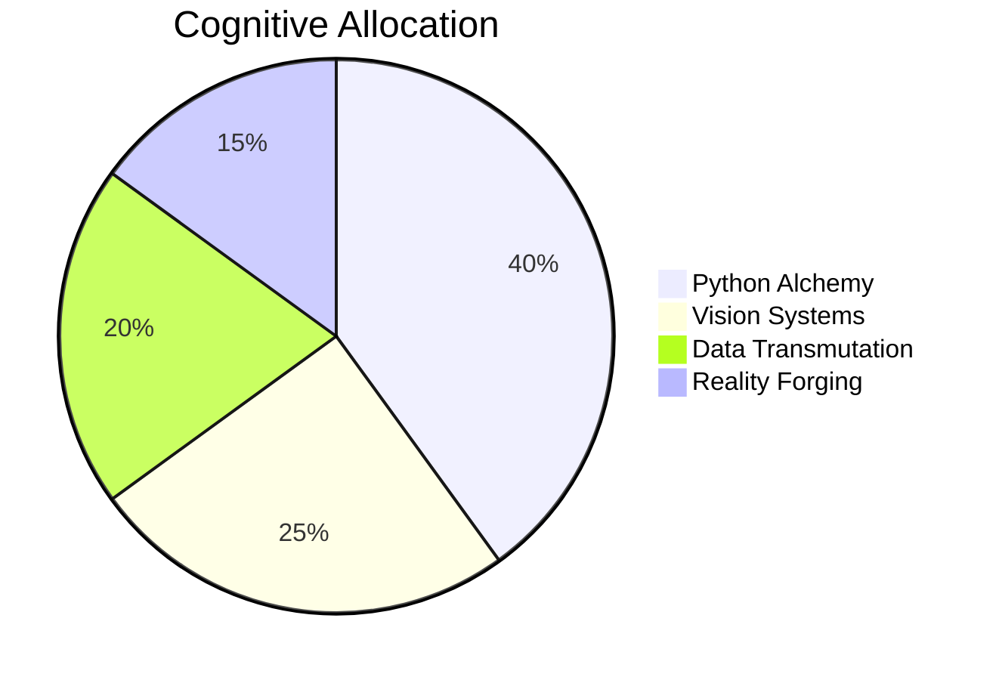

<h1 align="center">
  
</h1>

  <!-- Animated Tech Icons -->
  

    
    
    
    
  

  
  <!-- Glitch Text Effect -->
  

    <h2 style="margin: 15px 0; font-size: 32px; background: linear-gradient(45deg, #7F3DFF, #FF00C8); -webkit-background-clip: text; -webkit-text-fill-color: transparent; display: inline-block; text-shadow: 0 0 10px rgba(127, 61, 255, 0.7); position: relative; z-index: 2;">
      PYTHON DEVELOPER | COMPUTER VISION ENGINEER | AI ARTISAN
    </h2>
    
PYTHON DEVELOPER | COMPUTER VISION ENGINEER | AI ARTISAN

    
PYTHON DEVELOPER | COMPUTER VISION ENGINEER | AI ARTISAN

  

  
  <!-- Animated Terminal -->
  

    

      

      

      

    

    

      visx@github:~$ 
      
      
    

  

  <!-- Glowing Social Badges -->
  
  
  
  
  

---

## 🧪 About the Alchemist

  

    

      >>>  <strong style="background: linear-gradient(45deg, #7F3DFF, #FF00C8); -webkit-background-clip: text; -webkit-text-fill-color: transparent;">Self-taught cybermage</strong> transmuting data into digital gold 
      >>>  <strong style="background: linear-gradient(45deg, #00FFF0, #7F3DFF); -webkit-background-clip: text; -webkit-text-fill-color: transparent;">Architect of intelligent systems</strong> at the human-machine frontier 
      >>>  <strong style="background: linear-gradient(45deg, #FF5F56, #7F3DFF); -webkit-background-clip: text; -webkit-text-fill-color: transparent;">Conjurer of computer vision</strong> spells and pixel sorcery 
      >>>  <strong style="background: linear-gradient(45deg, #FFBD2E, #7F3DFF); -webkit-background-clip: text; -webkit-text-fill-color: transparent;">Forger of full-stack realities</strong> from abstract concepts 
    

    

      "I engineer digital synapses where data becomes intelligence, pixels gain perception, and algorithms breathe with purpose. My code doesn't just run - it <strong style="color: #FF00C8;">evolves</strong>."
    

  

  

    

      
      

        LEVEL 80 TECH SHAMAN
      

    

  

---

## ⚡ Cybernetic Arsenal

 
 <h3 style="margin-top: 0; color: #FF00C8;">⚗️ Currently Brewing</h3> 
 
  
Neural Alchemy
 
 
  
Quantum APIs
 
 
  
Cloud Sorcery
 
 
 
 

```mermaid
graph TD
  A[Core Systems] --> B[Python]
  A --> C[OpenCV]
  A --> D[TensorFlow]
  A --> E[PyTorch]
  
  F[Data Alchemy] --> G[Pandas/NumPy]
  F --> H[Matplotlib/Seaborn]
  F --> I[Power BI]
  
  J[Reality Forging] --> K[Flask/Streamlit]
  J --> L[HTML/CSS/JS]
  J --> M[MySQL]
  
  N[Neuro-Link Protocols] --> O[Git/GitHub]
  N --> P[VS Code]
  N --> Q[PyCharm]
  
  R[Cyber Vision] --> S[Image Processing]
  R --> T[Object Detection]
  R --> U[Neural Style Transfer]
  
  style A fill:#7F3DFF,stroke:#fff,stroke-width:2px
  style F fill:#FF00C8,stroke:#fff,stroke-width:2px
  style J fill:#00FFF0,stroke:#fff,stroke-width:2px
  style N fill:#FF5F56,stroke:#fff,stroke-width:2px
  style R fill:#FFBD2E,stroke:#fff,stroke-width:2px
```

🧬 Project Genesis Archives
🌀 AI IMAGE STUDIO - Pixel Reality Forge

 <a href="https://github.com/Its-Vikas-xd/AI-Image-Studio" style="display: inline-block; position: relative;">  
 
 
 ⚡ Real-time image transformation 
 
 🧠 AI-powered enhancement 
 
 🔮 Neural style transfer 
 
 
 </a> 
 <a href="https://github.com/Its-Vikas-xd/AI-Image-Studio" style="text-decoration: none;"> 
 ACCESS SOURCE CODE 🧪 
 </a> <a href="https://ai-image-studio.streamlit.app/" style="text-decoration: none;"> 
 LIVE DEMO PORTAL 🌀 
 </a> 
 
 
  Python 
 
  OpenCV 
 
  Streamlit 
 
  NumPy 
 
 

🎵 Spotify Analytics Dashboard - Sonic Data Sculptor

  <!-- Content similar to above but with different color scheme --> 

🛍️ Shopify Sales Dashboard - Commerce Visionary

  <!-- Content similar to above but with different color scheme --> 

📡 Neuro-Stats Interface

 

 
  
 
  
 

 <a href="https://github.com/Its-Vikas-xd?tab=repositories"> 
 EXPLORE THE DIGITAL LABYRINTH 🌀 
 </a> 

🧠 Synaptic Interface Protocol

 
 <h3 style="color: #00FFF0; margin-top: 0;">INITIATE CONNECTION SEQUENCE</h3> 
 <a href="mailto:itsvikassharma007@gmail.com" style="text-decoration: none;"> 
 📧 
 
Direct Message Channel
 
itsvikassharma007@gmail.com
 
 
 </a> <a href="https://www.linkedin.com/in/vikas-sharma-493115361/" style="text-decoration: none;"> 
 💼 
 
Professional Nexus
 
Vikas Sharma
 
 
 </a> 
  

  <h3 style="color: #FF00C8; margin-bottom: 15px;">COLLABORATION MATRIX</h3>
  

    

      🔄 Tech Synergy
    

    

      🚀 Project Ignition
    

    

      🧠 Knowledge Fusion
    

    

      💡 Innovation Catalyst
    

  

 

 

 
 ⚠️ WARNING: This digital entity contains advanced algorithms. Handle with curiosity. 
 
 ⚡ 🔥 🌀 
 
<!-- For the terminal typing effect -->
 
