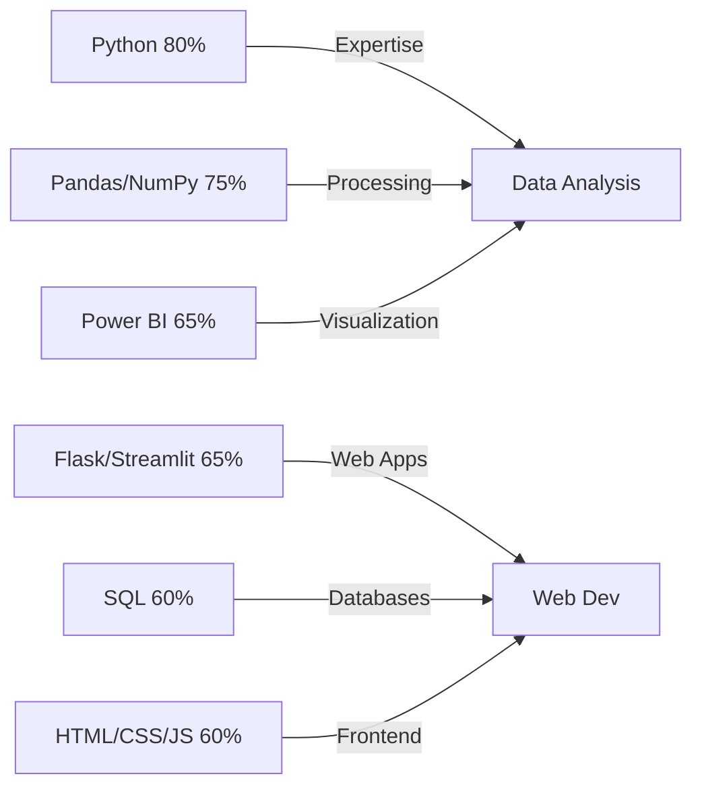

<h1 align="center">
  <a href="https://github.com/Its-Vikas-xd">
    
  </a>
</h1>

<div align="center">
  <h2 style="color: #7F3DFF;">Python Developer | Data Analyst | Full-Stack Explorer</h2>
  
</div>

<p align="center">
  <a href="https://vikas-portfolio-chi.vercel.app/">
    
  </a>
  <a href="https://www.linkedin.com/in/vikas-sharma-493115361/">
    
  </a>
  <a href="https://github.com/Its-Vikas-xd">
    
  </a>
  <a href="https://x.com/ItsVikasXd">
    
  </a>
  <a href="mailto:itsvikassharma007@gmail.com">
    
  </a>
</p>

---

## 🚀 About Me

<div style="display:flex; justify-content:space-between; align-items:center;">
  <div style="flex: 60%;">
    <p>
      <strong>🎓 Self-taught developer</strong> currently pursuing <strong>NIELIT O Level</strong><br>
      <strong>💡 Passionate</strong> about Data Analytics, Web Development, and IoT Systems<br>
      <strong>🔍 Transforming</strong> raw data into actionable insights using Python<br>
      <strong>🧩 Building</strong> innovative solutions to real-world problems<br>
      <strong>🚀 Constantly</strong> expanding my skill set through hands-on projects<br>
      <strong>☕ Fueled</strong> by curiosity, creativity, and coffee
    </p>
    <p>
      I'm on a mission to bridge the gap between data and actionable insights while creating impactful software solutions that solve real-world problems.
    </p>
  </div>
  <div style="flex: 40%; text-align:center;">
    
  </div>
</div>

---

## 🛠️ Tech Stack

<div align="center">
  
  ### 📊 Data & Analytics
  <p>
    
    
    
    
    
  </p>
  
  ### 🌐 Web Development
  <p>
    
    
    
    
    
  </p>
  
  ### ⚙️ DevOps & Tools
  <p>
    
    
    
    
  </p>
</div>

---

## 📊 Skill Proficiency



🌱 Currently Exploring
<div align="center" style="display: flex; justify-content: center; gap: 20px;"> <div style="text-align: center;">  <p><strong>TensorFlow</strong></p> </div> <div style="text-align: center;">  <p><strong>FastAPI</strong></p> </div> <div style="text-align: center;">  <p><strong>Azure</strong></p> </div> </div>
🏆 Featured Projects
🎵 Spotify Analytics Dashboard
<div align="center"> <a href="https://github.com/Its-Vikas-xd/spotify-analytics-Dashboard">  </a> <p> <em>Interactive Power BI dashboard analyzing Spotify listening patterns</em><br> Data from MySQL ➝ Cleaned in Pandas ➝ Multi-page visualization </p> <p>     </p> </div>
🛍️ Shopify Sales Dashboard
<div align="center"> <a href="https://github.com/Its-Vikas-xd/Shopify-Dashboard">  </a> <p> <em>Comprehensive sales dashboard tracking customer behavior and conversions</em><br> Sales analysis, retention metrics, and interactive visualizations </p> <p>     </p> </div>
📈 GitHub Analytics
<div align="center" style="display: flex; flex-wrap: wrap; justify-content: center; gap: 15px;"> <a href="https://github.com/Its-Vikas-xd">  </a> <a href="https://github.com/Its-Vikas-xd">  </a> <a href="https://github.com/Its-Vikas-xd">  </a> </div><div align="center" style="margin-top: 20px;"> <a href="https://github.com/Its-Vikas-xd?tab=repositories&q=&type=&language=python&sort=">  </a> </div>
🤝 Let's Collaborate
<div align="center"> <p>I'm always open to:</p> <div style="display: flex; justify-content: center; flex-wrap: wrap; gap: 10px; margin: 15px 0;"> <div style="background: rgba(127, 61, 255, 0.1); padding: 10px 15px; border-radius: 8px; border: 1px solid #7F3DFF;"> 🤝 Innovative collaborations </div> <div style="background: rgba(127, 61, 255, 0.1); padding: 10px 15px; border-radius: 8px; border: 1px solid #7F3DFF;"> 💬 Tech discussions </div> <div style="background: rgba(127, 61, 255, 0.1); padding: 10px 15px; border-radius: 8px; border: 1px solid #7F3DFF;"> 🚀 Career opportunities </div> <div style="background: rgba(127, 61, 255, 0.1); padding: 10px 15px; border-radius: 8px; border: 1px solid #7F3DFF;"> 📚 Knowledge sharing </div> </div> <div style="display: flex; justify-content: center; gap: 15px; margin-top: 20px;"> <a href="https://vikas-portfolio-chi.vercel.app/">  </a> <a href="mailto:itsvikassharma007@gmail.com">  </a> </div> </div>
<div align="center" style="margin-top: 40px;">  <p>✨ <em>Transforming data into decisions, code into solutions</em> ✨</p> <p>Made with ❤️ and Python</p> <div style="margin-top: 20px;">  </div> </div>
```
