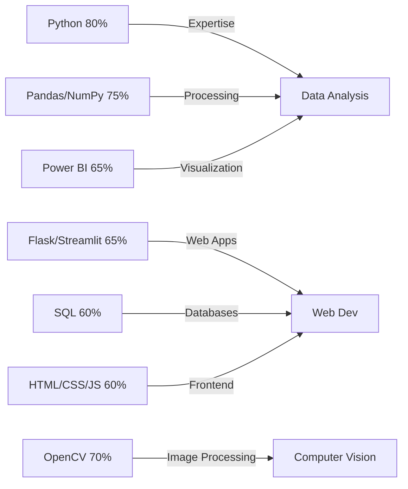

<h1 align="center">
  
</h1>

  <h2>
    
  </h2>
  

    
    
    
    
    
  

   
  
  
  
  
  

---

## 🚀 About Me

<table>
  <tr>
    <td width="60%">
      <ul>
        <li>🎓 <b>Self-taught developer</b> currently pursuing <b>NIELIT O Level</b></li>
        <li>💡 <b>Passionate</b> about Data Analytics, Web Development, and IoT Systems</li>
        <li>🔍 <b>Transforming</b> raw data into actionable insights using Python</li>
        <li>🧩 <b>Building</b> innovative solutions to real-world problems</li>
        <li>🚀 <b>Constantly</b> expanding my skill set through hands-on projects</li>
        <li>☕ <b>Fueled</b> by curiosity, creativity, and coffee</li>
      </ul>
      

        I'm on a mission to bridge the gap between data and actionable insights while creating impactful software solutions that solve real-world problems.
      

    </td>
    <td align="center">
      
    </td>
  </tr>
</table>

---

## 🛠️ Tech Stack & Tools

  
<b>📊 Data Analysis & Visualization</b>

  

    
    
    
    
    
    
    
  

  
<b>🧮 Mathematics & Statistics</b>

  

    
    
  

  
<b>🌠Web Development</b>

  

    
    
    
    
    
    
  

  
<b>💾 Databases & Querying</b>

  

    
    
  

  
<b>⚙️ DevOps & Tools</b>

  

    
    
    
    
    
  

  
<b>🧰 Productivity & Office Tools</b>

  

    
    
    
  

  
<b>🤖 Computer Vision</b>

  

    
  

---

## 📊 Skill Proficiency

---

### 🌱 Currently Exploring

  
  
  

---

## 🏆 Featured Projects

### 🖼️ AI Image Studio

  
  

    <em>Advanced image processing application using OpenCV and Streamlit</em> 
    Features: Background removal, filters, transformations, and AI enhancements
  

  

    
    
  

  

    
    
    
  

### 🎵 Spotify Analytics Dashboard

  
  

    <em>Interactive Power BI dashboard analyzing Spotify listening patterns</em> 
    Data from MySQL ➝ Cleaned in Pandas ➝ Multi-page visualization
  

  

    
    
    
    
  

### 🛍️ Shopify Sales Dashboard

  
  

    <em>Comprehensive sales dashboard tracking customer behavior and conversions</em> 
    Sales analysis, retention metrics, and interactive visualizations
  

  

    
    
    
    
  

---

## 📈 GitHub Analytics

  
  
  

 

  

---

> *Thanks for visiting! Feel free to connect, collaborate or just say hi! 🚀*
